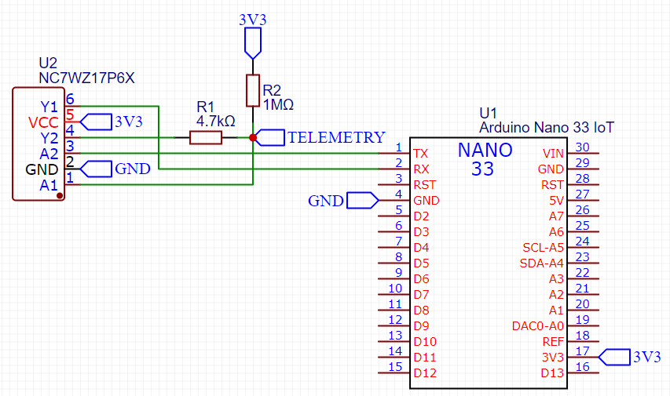
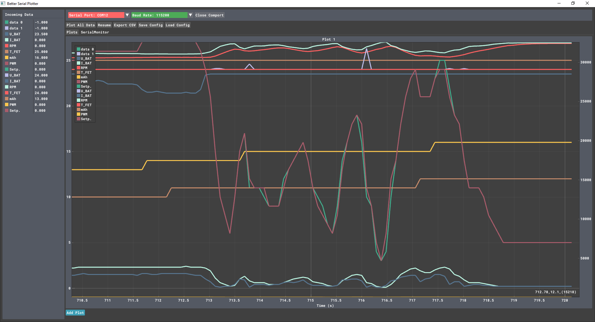

# rcreader
 Read telemetry data from ESC (Electronic speed control).

Arduino UART are combined to one wire with a NC7WZ17 Dual Buffer. 1MΩ pull-up resistor and 4.7KΩ resistor between RX buffer output and one wire.

Arduino reads telemetry data from ESC with [MSB (Multiplex Sensor Bus)](https://www.multiplex-rc.de/userdata/files/beschreibung-sensor-bus-v2.pdf) protocol.
The data is outputted over USB/Serial and can be received by [BSP (Better Serial Plotter)](https://github.com/nathandunk/BetterSerialPlotter).
BSP Config: [bsp_config.json](bsp_config.json)

